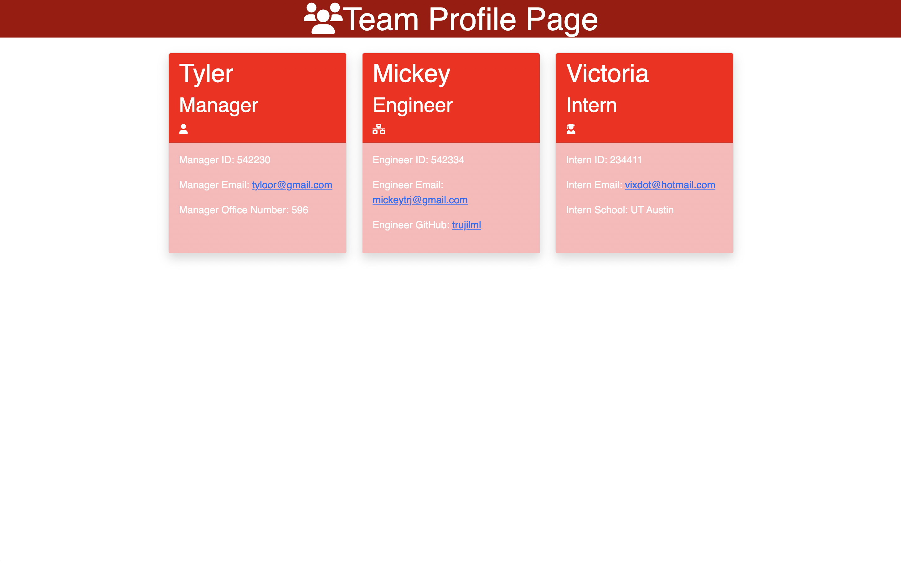

# Team Profile Generator

## Description 
This application takes in information of your employees on a software engineering team and generates an HTML webpage which presents summaries of each employee based on the information submitted.

By entering `node index.js` on the command-line application, you will begin entering information on your employees using your command-line terminal. You will be first prompted to enter information on your manager (their name, employee ID, email address and office number) before having the ability to add your employees (with either the engineer or intern criteria). Adding the engineer or intern employee will ask for its own respective information (engineer will require GitHub username and the intern will require their school name) following the submission of their name, employee ID, and email address. When the team building is completed, the user will have an generated HTML webpage to see their team page. The generated email is clickable and allows the user to email to that email address alongside the GitHub username from the engineer employee, which will take the user to the GitHub profile of that username.

## Table of Contents
  - [Description](#Description)
  - [Installation](#Installation)
  - [Usage](#Usage)
  - [Tests](#Tests)
  - [Developed With](#Developed-with)

## Installation
- This file can be cloned through GitHub using the above Code button.
- Node.js, npm, Inquirer, and Jest installation are required prior to running tests and starting the command-line application. 

## Usage 
- Open the terminal through either the Integrated Terminal on VS Code or through the Terminal application on Mac OS once the cloned file has been loaded and respective installers are present (Node.js, Inquirer, Jest).
- Prior to starting, `npm run test` to prove all test content file from lib in __tests__ pass. This uses the Jest application.
- Type `node index.js` to get started.
- Enter input into the prompts (run on Inquirer package).
- A responsive, designed HTML webpage will be generated when completed entering the prompts of your work team. Please refer to the index.html file in the samples folder for review.

## Tests 
- Prior to starting the application, enter `npm run test` in your terminal to run Jest on the tests to ensure all test objects run properly. 

## Developed With 
- JavaScript 
- Node.js
- Inquirer - demonstration of prompts ran for user to enter information of their work team
- Jest - demonstrated use of object-oriented programming and test-driven development when it came to running tests on the respective classes (Employee, Engineer, Intern, Manager)
- HTML
- CSS

